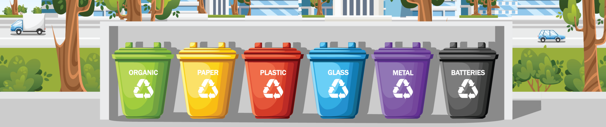

# WasteNet - Garbage Classification System



## Description
This project implements an image classification system for sorting waste into 12 different categories using deep learning techniques. The model is designed to help address waste management challenges by automatically categorizing different types of garbage, making sorting more efficient and accurate.

## Dataset
The project uses the [Garbage Classification](https://www.kaggle.com/datasets/mostafaabla/garbage-classification/data) dataset which includes:
- 15,000+ images
- 12 different categories of waste
- Various image resolutions
- Categories include: battery, biological, brown-glass, cardboard, clothes, green-glass, metal, paper, plastic, shoes, trash, and white-glass

## Requirements
- TensorFlow
- scikit-learn
- Pillow
- NumPy
- Pandas
- Matplotlib
- TensorFlow.js (for web conversion)
- Requests (for inference)

## Docker Setup
To run the project in a Docker container, follow these steps:
1. Build the Docker image:
```bash
docker build -t garbage-classifier .
```
2. Run the Docker container:
```bash
docker run -p 8501:8501 garbage-classifier
```
3. Access the REST API endpoint:
```bash
curl -X POST http://localhost:8501/v1/models/garbage_classifier:predict -T metal118.jpg
```

## Model Architecture
The model uses MobileNetV2 as the base architecture with additional layers:
- Pre-trained MobileNetV2 (first 20 layers fine-tuned)
- Additional Conv2D layer (256 filters)
- MaxPooling2D layer
- Global Average Pooling
- Dropout (0.3)
- Dense output layer (12 classes)

## Training
The model is trained with the following specifications:
- Image size: 224x224x3
- Batch size: 64
- Data split: 80% training, 10% validation, 10% testing
- Data augmentation: rotation, shift, shear, zoom, and horizontal flip
- Learning rate: Initial 1e-3 with reduction on plateau
- Early stopping with patience of 5 epochs
- Maximum epochs: 20

## Model Export
The model is exported in multiple formats:
1. TensorFlow SavedModel
2. TFLite model
3. TensorFlow.js model

## Inference
The project includes an inference module with the following features:
- Image preprocessing
- REST API endpoint support
- Confidence score calculation
- Class prediction with probability scores

Example usage:
```python
image_path = 'metal118.jpg'
endpoint = "http://localhost:8501/v1/models/garbage_classifier:predict"
result = process_and_predict(image_path, endpoint)
```

## Labels
The model classifies images into the following categories:
1. Battery
2. Biological
3. Brown-glass
4. Cardboard
5. Clothes
6. Green-glass
7. Metal
8. Paper
9. Plastic
10. Shoes
11. Trash
12. White-glass

## Contributing
Feel free to submit issues and enhancement requests!

## License
This project is licensed under the MIT License - see the [LICENSE](LICENSE) file for details.
```